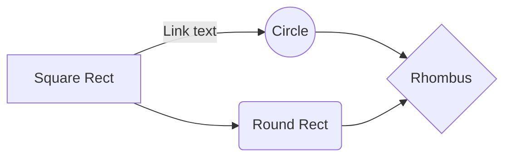
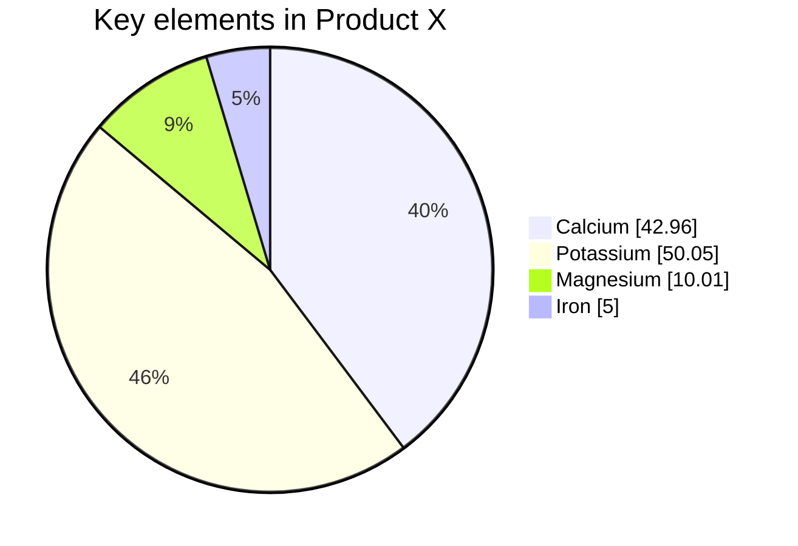
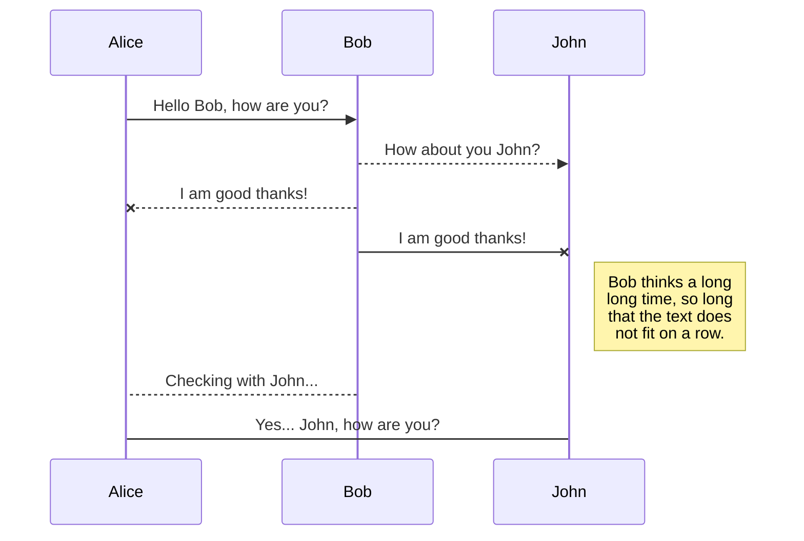

> This is the quote block.

For example, the following Markdown,

When $a \ne 0$, there are two solutions to $(ax^2 + bx + c = 0)$ and they are 
$$ x = {-b \pm \sqrt{b^2-4ac} \over 2a} $$

$c^2 = \sqrt{a^2+b^2}$

* $sin = o/h$
* $cos = a/h$
* $tan = o/a$

Use `git status` to list all new or modified files that haven't yet been committed.

This site was built using [GitHub Pages](https://pages.github.com/).


# Using emoji

You can add emoji to your writing by typing :EMOJICODE:.

@octocat :+1: This PR looks great - it's ready to merge! :shipit:

The lists:

- first
- second
- third
- forth
  * one
  * two
  * three

---
Article name: "Example snippet."
Date: 2022-10-31, 16:30
Author: yothinin
---

```tsql
SELECT * FROM t_daily
WHERE dai_date = '2022-10-31'
```

```C
#include <stdio.h>
int main(int argc, char **argv){
  printf ("Hello world!\n");
  return 0;
}
```

Here is a simple flow chart:




Pie chart


Basic sequence diagram


<h3>User Journey Diagram</h3>

User journeys describe at a high level of detail exactly what steps different users take to complete a specific task within a system, application or website. This technique shows the current (as-is) user workflow, and reveals areas of improvement for the to-be workflow. (Wikipedia)

Mermaid can render user journey diagrams:

```mermaid
journey
    title My working day
    section Go to work
      Make tea: 5: Me
      Go upstairs: 3: Me
      Do work: 1: Me, Cat
    section Go home
      Go downstairs: 5: Me
      Sit down: 5: Me
 ```
 
 This sentence uses `$` delimiters to show math inline:  $\sqrt{3x-1}+(1+x)^2$
 
<h3>Creating a table</h3>

You can create tables with pipes | and hyphens -. Hyphens are used to create each column's header, while pipes separate each column. You must include a blank line before your table in order for it to correctly render.


| First Header  | Second Header |
| ------------- | ------------- |
| Content Cell  | Content Cell  |
| Content Cell  | Content Cell  |

https://docs.github.com/en/get-started/writing-on-github/working-with-advanced-formatting/attaching-files


